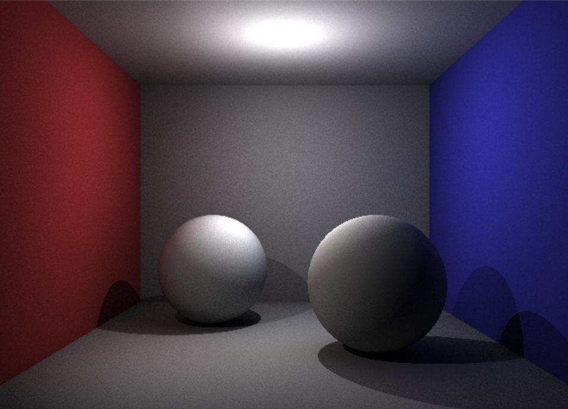

# 计算机图形学学习用项目——离线渲染
## 概述
师从 <a href="https://space.bilibili.com/241656343/">发财学长</a>，教程非常优秀，在此感谢！  
项目基于`numpy`/`cupy`实现（因为我不会C++），`pygame`仅用于按给定的像素数组绘制窗口，目前还在边学边做  
在环境配置及修复、代码检查中借助了Agent
## 使用
```bash
python -m run --scene '<scene>' --config '<config>'
```
## 效果
### 间接光照
